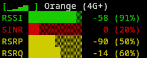

# NightHawk

Simple curses widget displaying NetGear NightHawk connection status.



# Usage

> __NOTE__: Make sure [poetry](https://python-poetry.org/) is installed on your system.

1. Install dependencies

```
poetry install
```

2. Run the script

```
poetry run nighthawk/main.py --password MyPassword
```

## Options

```
usage: main.py [-h] [-u USER] [-p PASSWORD] [-a ADDRESS]

options:
  -h, --help            show this help message and exit
  -u USER, --user USER
  -p PASSWORD, --password PASSWORD
  -a ADDRESS, --address ADDRESS
```
